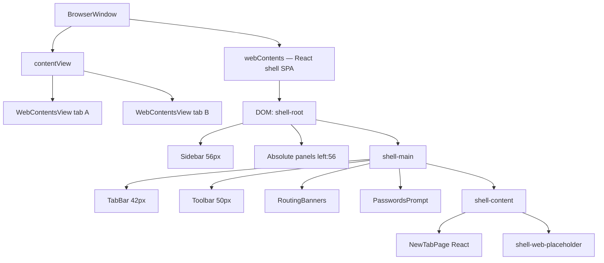

# Shell / Render Architecture Audit (Read-Only)

**Date:** 2026-05-28  
**Scope:** `apps/desktop-electron` shell, layout, overlays, tab groups, workspaces  
**Method:** Code review only — no fixes applied in this document  
**Codebase path audited:** `C:\Браузер\alpha-browser` (WSL: `/mnt/c/Браузер/alpha-browser`)

---

## Executive summary

Alpha Browser uses a **single `BrowserWindow`** whose **main `webContents` renders the entire React chrome** (sidebar, tab bar, toolbar, panels, NTP), while **`WebContentsView` instances are children of `contentView`** and paint **native web pages over the content rectangle**. This is a **split compositor model**: React and `WebContentsView` are not one DOM tree; **CSS `z-index` in the renderer cannot reliably stack above `WebContentsView` in the content region**.

Recent instability comes from **treating popup/menu/layout concerns as bounds problems** (side-panel reserve, animated relayout) while **also using React modals/portals in zones owned by `WebContentsView`**. Each partial fix shifts pain between overlays, NTP, and page layout.

---

## 1. CURRENT ARCHITECTURE

### 1.1 Window hierarchy (as implemented)



| Layer | Owner | Loads | Visible region |
|--------|--------|--------|----------------|
| Main `webContents` | Renderer process | `renderer/index.html` → `BrowserShell` | Full window (theoretically) |
| `WebContentsView` × N | Main / `TabManager` | https://… guest pages | Bounds from `getWebContentBounds()` |
| Native `Menu.popup()` | OS / Electron | — | Above everything (separate surface) |
| Child `BrowserWindow` | **Not used** | — | — |

**There is no dedicated chrome-only `BrowserWindow`.** Chrome and “page hole” are simulated: React draws chrome; main positions WCV over the lower-right rectangle.

### 1.2 Bounds contract (`getWebContentBounds`)

**Source:** `packages/shared-types/src/index.ts`

```ts
x = sidebarWidth (56) + sidePanelReservePx
y = tabBarHeight (42) + toolbarHeight (50)  // fixed 92px
width = windowWidth - x
height = windowHeight - y
```

**Applied in:** `TabManager.layoutViews()` → `entry.view.setBounds(bounds)` for every tab with a view.

**Triggers for `layoutViews()`:**

| Trigger | File | Effect |
|---------|------|--------|
| Window `resize` | `TabManager` constructor | Relayout all WCV |
| `setSidePanelReservePx` | `register-shell` IPC ← `useSidePanelLayoutSync` | Horizontal shrink/grow |
| `updateViewVisibility` / tab switch | `switchTab`, collapse logic | Relayout |
| `attachAndLoad` / `createWebView` | New web tab | Initial bounds |

**Not in current tree (removed or never merged):** `overlayTopReservePx`, `setLayoutInsets`, `chromeLayoutCoordinator`, popup-driven vertical push-down. **Only horizontal `sidePanelReservePx` remains.**

### 1.3 Renderer layout sync

| Mechanism | Direction | Purpose |
|-----------|-----------|---------|
| `tabs:state-changed` | Main → Renderer | Tabs, session groups, routing/proxy/adblock/passwords snapshots |
| `shell:setSidePanelReserve` | Renderer → Main | Panel open → shrink WCV width |
| `saved-groups:changed` | Main → Renderer | Saved workspaces list |
| `useSidePanelLayoutSync` | Renderer local | Animates reserve 0→360px over **180ms** (RAF) |

**Desync risk:** Panel CSS width is fixed **360px** (`globals.css`); reserve uses `CHROME_LAYOUT.groupsPanelWidth` / `sidePanelWidth` (also 360). Animation changes WCV every frame while panel appears instantly → visible “jank” and transient overlap.

### 1.4 Chrome vs content vertical boundary (critical gap)

`getWebContentBounds().y` is **hard-coded to 92px** (tab + toolbar only).

`BrowserShell` also renders **below the toolbar**:

- `RoutingBanners`
- `PasswordsPrompt`

These live in `shell-main` **above** `shell-content` but **below** the 92px line used for WCV. **`WebContentsView` starts at y=92 and can paint over banners/password UI** unless they are short enough to fit in the flex gap (they are not accounted for in bounds).

**NTP** renders inside `shell-content` (below banners). **WCV is hidden** for `kind === 'ntp'`, so NTP is not covered by WCV — but **side panel does not shrink NTP horizontally** (only WCV gets `sidePanelReserve`). Panel overlays the left part of NTP.

---

## 2. CRITICAL PROBLEMS

1. **Fundamental layering:** React overlays in the content band (y ≥ 92) compete with `WebContentsView`; `z-index` is ineffective against native views.
2. **Dual layout truth:** React flex column height (banners, prompts) ≠ `getWebContentBounds().y`.
3. **Side panel model:** Reserve shrinks **only WCV**, not NTP; panel + NTP interaction is inconsistent with web tabs.
4. **Animated reserve:** Popup-driven layout animation without matching panel/WCV choreography.
5. **Conceptual merge:** Session **tab groups** vs saved **workspaces** share UI, colors, and mental model; `sourceSavedGroupId` links them but product surfaces still overlap.
6. **Orphan / dead UI:** `RoutePopup.tsx`, `ContextMenu.tsx`, `WorkspaceEditor.tsx`, `routePopupOpen` store — partial migrations leave dead paths.
7. **Fullscreen `modal-overlay`:** `RoutingSettings`, `DownloadsShelf` confirm, `WorkspaceEditor` (modal mode) — all `position: fixed; inset: 0; z-index: 100` on chrome `webContents` → **under WCV** on web tabs.
8. **Downloads shelf:** `position: fixed; bottom: 16px; z-index: 90` — same content band as WCV → likely **under site**.
9. **Iterative fixes:** Native menus for tab/group/route added while React modals remain for settings/downloads — inconsistent overlay strategy.

---

## 3. ROOT CAUSES

| Symptom | Root cause |
|---------|------------|
| Popup under site | WCV composites above main `webContents` in page rectangle |
| Menu “fixes” break layout | Bounds changed to compensate for overlay failures |
| NTP “shifts” or breaks | NTP is React in `shell-content`; reserve doesn’t reflow NTP; panel overlaps |
| White native menus | Correct escape hatch for tab/group/route; inconsistent with rest of UX |
| Groups/workspaces confusion | Two persistence models + shared color/title + mixed panel/NTP copy |
| Stuck gray overlay (historical) | Native menu dimming + React second layer (modal/backdrop) |
| Panel under site | CSS panel in renderer + WCV full width until reserve applied; animation lag |

**Single sentence:** The shell assumes **one coordinated layout engine** but implements **two renderers** (React DOM + `WebContentsView`) with **only partial bounds coupling** and **popup UI chosen by feature, not by layer rules**.

---

## 4. WHAT MUST NEVER BE DONE AGAIN

1. **Do not** use fullscreen React `modal-overlay` for UI that must appear while a **web tab** is active in the content area.
2. **Do not** drive `getWebContentBounds()` from **popup open/close** (vertical or horizontal “overlay reserve”).
3. **Do not** use `createPortal` + `z-index` expecting to cover YouTube/GitHub in the page region.
4. **Do not** add `CHROME_BOTTOM` clamping as a substitute for native menus — it only works for menus entirely above y=92.
5. **Do not** animate `setSidePanelReserve` per-frame without **locking** panel width and chrome layout to the same timeline.
6. **Do not** label URL-collection flows “группа” in UI — use **набор сайтов / workspace** vs **группа вкладок**.
7. **Do not** stack React color picker / confirm on top of `Menu.popup()` (Windows dimming + React backdrop = stuck state).
8. **Do not** extend `y` offset in `getWebContentBounds` without measuring **all** chrome rows in `shell-main` (banners, prompts, future bars).

---

## 5. SAFE ARCHITECTURE RULES

### 5.1 Zone map

| Zone | y (approx) | Safe UI technology |
|------|------------|-------------------|
| Sidebar | full height, x 0–56 | React only |
| Tab bar | 0–42 | React only |
| Toolbar | 42–92 | React only; **native menu OK** anchored to toolbar controls |
| Chrome extensions | 92+ in `shell-main` but outside WCV if bounds updated | React **only if** bounds push WCV below measured height |
| Page / content | 92+ (today) | **WebContentsView only** for web; NTP = React with **no WCV** |
| Left panel band | x 56–416 when open | React panel + **must** shrink content via reserve OR true overlay on NTP only |

### 5.2 What MAY change WCV bounds

| Allowed | Forbidden |
|---------|-----------|
| Window resize | Popup/menu open |
| Side panel open/close (horizontal reserve) | Context menu |
| Explicit split-view width (future, designed) | “Scroll/clamp” fake reserves |
| Measured chrome height (if banners/prompts formalized) | Animated reserve without design |

### 5.3 What MAY use React overlays

| OK | Not OK on active web tab |
|----|---------------------------|
| NTP entire page | Centered modal routing settings |
| Inline forms in side panel (panel is left of WCV when reserve synced) | Downloads shelf bottom sheet |
| Toolbar-adjacent inline (within y&lt;92) | Route/proxy popup modal |
| Dev-only tools | Workspace URL editor modal |

### 5.4 z-index rule

**`z-index` only orders within main `webContents` DOM.** It does not order above `WebContentsView`. Treat z-index as **chrome-internal** only.

---

## 6. RECOMMENDED OVERLAY STRATEGY

| UI | Current | Recommended | Rationale |
|----|---------|-------------|-----------|
| Tab context menu | Native `Menu.popup` | **Keep native** | Small, above page |
| Group context menu | Native + `dialog` for close | **Keep native** + sync dialog | No React backdrop |
| Route / proxy / AdBlock quick | Native `Menu.popup` (recent) | **Keep native** for MVP | Toolbar-adjacent actions |
| Routing settings (full form) | React `modal-overlay` | **Side panel page** or **child `BrowserWindow`** | Too large for menu |
| Bookmarks / history / downloads panels | React + side reserve | **Keep**; fix reserve sync | Designed for horizontal split |
| Groups panel | React + reserve | **Keep**; separate tab-group vs workspace sections | Same |
| Downloads shelf | React fixed bottom | **Child window** or **panel tab** | Content-band placement |
| Downloads danger confirm | React modal | **`dialog.showMessageBoxSync`** | Same as group close |
| Workspace URL editor | Hidden from main / inline | **Defer** or settings route on NTP only | Not primary flow |
| Passwords prompt | Inline in `shell-main` | **Measure height → increase WCV y** or anchor in toolbar row | Avoid WCV overlap |
| `ContextMenu.tsx` | Unused for tabs | **Delete or sidebar-only** | Misleading API |
| `RoutePopup.tsx` | Orphan component | **Remove** | Replaced by native menu |

### Child `BrowserWindow` (when justified)

Use for: large forms, persistent tools, downloads manager if not a side panel — **frameless, always-on-top, parent-bound**, positioned from toolbar button screen coords. **Not** for every menu (too heavy).

---

## 7. RECOMMENDED TAB GROUP MODEL

### Concepts (must stay separate)

| | **Session tab group** | **Saved workspace (набор сайтов)** |
|--|------------------------|-------------------------------------|
| **What** | Open tabs grouped in this session | Saved list of URLs |
| **Storage** | `TabManager.sessionGroups` + `tab.sessionGroupId` | `SavedGroupsStore` (disk) |
| **Created** | Tab bar: ПКМ, drag-drop, “Создать группу вкладок” | Future: settings/import only |
| **URL prompt** | Never | Only when explicitly editing workspace |
| **UI home** | Tab bar chip + native menus | Optional NTP list “Открыть набор” |
| **Color** | `SessionGroup.color` | `SavedGroup.color` |
| **Link** | `sourceSavedGroupId` when opened from saved | Updates when linked + color sync (implemented in main) |

### Ownership

- **Source of truth (tabs in group):** `tab.sessionGroupId` in main; `group.tabIds` derived in `normalizeSessionGroups()`.
- **Renderer:** `buildTabBarItems()` may reconcile `tabIds` from tabs — display only; **never create groups in renderer alone**.
- **tabOrder:** Main `tabOrder` array; renderer reorder via IPC.

### UI boundaries

- **Tab bar:** collapse, rename (inline/IPC), color (native submenu), drag-drop.
- **Sidebar panel:** Optional “open saved workspace” list — **not** primary tab-group creation.
- **NTP:** Primary “Создать группу вкладок” → `createSessionGroupWithNewTab()` — **no URL form**.

---

## 8. RECOMMENDED NTP MODEL

### Current (correct direction)

- `tab.kind === 'ntp'` → **no `WebContentsView`** (`view: null`).
- `BrowserShell` `showNtp` → renders `NewTabPage` in `shell-content`.
- Navigate from NTP → `promoteToWeb()` creates WCV.

### Why NTP breaks when “fixing shell”

| Change | NTP effect |
|--------|------------|
| `sidePanelReserve` | WCV hidden but **NTP layout unchanged** — panel overlaps NTP |
| Modal overlays | NTP visible (no WCV) — modals work on NTP only |
| Bounds push-down (historical) | Would empty `shell-content` or clip NTP |
| Mixed “workspace” buttons | User expects tab group; URL editor appears |

### Recommendation

1. **Keep NTP as React** in chrome `webContents` (matches `docs/architecture.md` §3.3).
2. **Do not** load NTP in `WebContentsView` for MVP (adds privilege/layout complexity).
3. **Apply horizontal inset to NTP** when side panel opens: either `margin-left` on `shell-content` matching `sidePanelReservePx`, or treat NTP as full-window with panel as overlay (explicit product choice).
4. **NTP-specific UI only** for workspace management when reintroduced; tab-group CTA stays one-click.

---

## 9. REACT ANTI-PATTERNS (observed)

| Pattern | Location | Risk |
|---------|----------|------|
| Fullscreen `modal-overlay` | `RoutingSettings`, `RoutePopup`, `WorkspaceEditor`, `DownloadsShelf` | Under WCV |
| Portal context menu | `ContextMenu.tsx` | Clamped to y&lt;92 — useless for tab bar lower edge / page |
| `routePopupOpen` dead state | `tabsStore` | Confusion |
| Nested buttons (partially fixed) | `BookmarksPanel`, `HistoryPanel` | a11y / hydration warnings |
| Renderer panel open state | `groupsPanelOpen`, etc. | Not in main — OK for UI-only, bad if assumed for security |
| `setFromMain` replaces entire snapshot | Zustand | Overwrites renderer-only flags unless merged carefully (currently separate keys) |
| Duplicate group ordering | `tabBarOrder` vs main `tabOrder` | Reorder IPC + local splice — race if both update |

---

## 10. RENDERER / MAIN SYNCHRONIZATION

### Authoritative (main)

- Tab lifecycle, `WebContentsView`, bounds, visibility
- `sessionGroups` map, `activeTabId`, `tabOrder`
- Routing, proxy, adblock snapshots embedded in `getState()`
- Saved groups disk I/O

### Renderer-only (OK)

- Panel open flags (`*PanelOpen`, `downloadsShelfOpen`, `routingSettingsOpen`)
- Address bar draft, search query on NTP
- Drag-drop visual state (`dragTabId`, `dropTarget`)

### Risk areas

| Area | Issue |
|------|--------|
| `buildTabBarItems` | Rebuilds `group.tabIds` from tabs — can mask main desync briefly |
| Collapsed group visibility | Main `updateViewVisibility` — renderer shows collapsed chip |
| `savedGroups` | Separate IPC channel — not in `BrowserStateSnapshot` |
| Animated reserve | Renderer drives layout without main knowing “animation in progress” |
| Color sync | `setSessionGroupColor` updates saved group if linked — good; renderer cards depend on `saved-groups:changed` |

---

## 11. FULL OVERLAY INVENTORY

| # | UI | Renders in | Under WCV on web? | Intended layer | Conflicts? |
|---|-----|------------|-------------------|----------------|------------|
| 1 | Tab menu | `native-context-menus.ts` | No | Native | Low |
| 2 | Group menu | Native | No | Native | Low |
| 3 | Group close confirm | `dialog.showMessageBoxSync` | No | Native | Low |
| 4 | Route/proxy menu | `native-route-menu.ts` | No | Native | Low |
| 5 | Route popup (legacy) | `RoutePopup.tsx` | **Yes** if mounted | React modal | **High** — orphan |
| 6 | Routing settings | `RoutingSettings.tsx` | **Yes** | React modal | **High** |
| 7 | AdBlock (toolbar) | Routes to native menu | No | Native | Low |
| 8 | Bookmarks panel | `BookmarksPanel` | No (reserve) | Side panel | Medium — reserve sync |
| 9 | History panel | `HistoryPanel` | No (reserve) | Side panel | Medium |
| 10 | Downloads panel | `DownloadsPanel` | No (reserve) | Side panel | Medium |
| 11 | Groups panel | `GroupsPanel` | No (reserve) | Side panel | Medium |
| 12 | Downloads shelf | `DownloadsShelf` | **Likely yes** | Bottom sheet | **High** |
| 13 | Downloads confirm | Modal in shelf | **Yes** | React modal | **High** |
| 14 | Workspace editor | `WorkspaceEditor` | Modal: yes; inline in panel: OK | Mixed | Medium if re-enabled |
| 15 | NTP cards | `NewTabPage` | No (no WCV on NTP) | React | Low on NTP only |
| 16 | Passwords prompt | `PasswordsPrompt` | **Overlap y=92** | Inline chrome | **High** — bounds gap |
| 17 | Routing banners | `RoutingBanners` | **Overlap y=92** | Inline chrome | **High** — bounds gap |
| 18 | Crash banner | `shell-content` | Competes with WCV | React | Medium |
| 19 | Context menu component | Portal body | Clamped &lt;92 | React | Unused for tabs |
| 20 | Loading bar | `shell-content` top | Under WCV | Chrome decoration | Low |

---

## 12. PRIORITY ORDER OF FIXES (recommendation only — not implemented here)

1. **Freeze bounds API** — document single owner; no popup-driven changes.
2. **Formalize chrome height** — measure banners + password prompt; set `getWebContentBounds().y` dynamically or relocate UI into y&lt;92.
3. **Unify overlay policy** — native menu vs side panel vs child window decision table enforced in code review.
4. **Remove dead React overlay code** — `RoutePopup`, unused `ContextMenu` paths, `routePopupOpen`.
5. **Side panel + NTP** — apply same horizontal inset to `shell-content` as WCV reserve OR accept overlay-only on NTP.
6. **Routing settings** — move to side panel route (fourth panel) or child window.
7. **Downloads shelf** — panel or child window.
8. **Workspace editor** — defer; keep “open saved” only until workspace v2.
9. **Tab groups / workspaces** — enforce naming and entry points per §7.

---

## 13. RISK MAP

| Change type | Regression risk | Affected surfaces |
|-------------|-----------------|-------------------|
| Touch `getWebContentBounds` | **Critical** | All web tabs, resize, panels |
| New React modal | **High** | Web tabs under WCV |
| Native menu item | Low | Menus only |
| Side panel width change | Medium | WCV width, CSS sync, animation |
| NTP layout CSS | Medium | Home, create group CTA |
| Session group IPC | Medium | Tab bar, collapse, drag |
| Saved groups | Low | Disk, NTP cards |

---

## 14. ARCHITECTURAL DEBT REGISTER

| ID | Debt | Severity |
|----|------|----------|
| D1 | Single-window dual compositor without documented zone rules | Critical |
| D2 | Fixed y=92 ignores dynamic chrome rows | High |
| D3 | `sidePanelReserve` affects WCV but not NTP layout | High |
| D4 | Animated reserve vs instant panel | Medium |
| D5 | Orphan overlay components / store flags | Medium |
| D6 | Tab groups vs workspaces product separation incomplete | Medium |
| D7 | `docs/architecture.md` §3.4 vs actual stacking (banners) | Medium |
| D8 | Downloads UI in content band | High |
| D9 | Routing settings modal on web tabs | High |
| D10 | `ContextMenu.tsx` misleading survival | Low |

---

## 15. UNSAFE PATTERNS (grep/watch list)

- `modal-overlay` in any component reachable during `kind === 'web'`
- `createPortal(..., document.body)` for page-adjacent UI
- `setSidePanelReserve` called outside `useSidePanelLayoutSync`
- `layoutViews` triggered from menu handlers
- `overlayTopReserve`, `setLayoutInsets`, `chromeLayoutCoordinator` (reintroduction)
- UI strings: «Новая группа» + URL form
- React submenu after `Menu.popup()` (color picker history)

---

## 16. RECOMMENDED MIGRATION PATH (phased, no code in this audit)

### Phase A — Stabilize boundaries (1–2 days)

- Write team rules from §5; PR checklist.
- Remove orphan overlays; wire routing settings to side panel **or** child window.
- Fix chrome height measurement for WCV `y`.

### Phase B — Layout coherence (2–3 days)

- NTP horizontal inset = `sidePanelReservePx`.
- Remove animated reserve OR animate panel + bounds together.
- Downloads: move to panel or native/dialog patterns.

### Phase C — Product model (1–2 days)

- Tab group vs workspace copy and entry points frozen.
- Workspace v2: explicit editor off critical path.

### Phase D — Optional structural (later)

- Dedicated chrome strip `BrowserView` / separate window — only if dual compositor pain remains.

---

## 17. REFERENCE FILES

| Topic | Path |
|-------|------|
| Bounds | `packages/shared-types/src/index.ts` → `getWebContentBounds` |
| Layout | `apps/desktop-electron/src/main/tabs/TabManager.ts` → `layoutViews`, `setSidePanelReservePx` |
| Panel sync | `apps/desktop-electron/src/renderer/src/hooks/useSidePanelLayoutSync.ts` |
| Shell tree | `apps/desktop-electron/src/renderer/src/components/BrowserShell.tsx` |
| Native menus | `apps/desktop-electron/src/main/shell/native-context-menus.ts`, `native-route-menu.ts` |
| IPC shell | `apps/desktop-electron/src/main/ipc/register-shell.ts` |
| State | `apps/desktop-electron/src/renderer/src/store/tabsStore.ts` |
| Tab bar order | `apps/desktop-electron/src/renderer/src/utils/tabBarOrder.ts` |
| Original intent | `docs/architecture.md` §3.3–3.6 |

---

## 18. CONCLUSION

The shell is **not unstable because React is weak** — it is unstable because **two render trees share one window without a strict contract**. Popups failed → bounds hacks → NTP and panel desync → native menus as partial escape → UX regression to “white menus.”

**Stable MVP path:** enforce **zone-based UI technology** (native menu / side panel with reserve / child window / NTP-only React), **stop moving `WebContentsView` for overlays**, and **split tab groups from workspaces in product and code entry points**.

No further layering fixes should ship without updating this document and `getWebContentBounds` contract first.

---

## Appendix: Phase A stabilization (2026-05-28)

Applied in `shell-phase-a-stabilize-2026-05-28`:

- Zone rules: `packages/shared-types/src/shell-zones.ts`, `renderer/src/shell/shell-layout-policy.ts`
- Dead overlays removed: `RoutePopup.tsx`, `ContextMenu.tsx`, `WorkspaceEditor.tsx`, `routePopupOpen`
- Route/proxy: native menu only (`native-route-menu.ts`)
- Routing settings: side panel (not modal)
- Unified horizontal inset: `--shell-side-panel-reserve` + instant `setSidePanelReserve`
- Chrome height: `ResizeObserver` → `shell:setChromeTopHeight` → `getWebContentBounds(..., chromeTopHeightPx)`
- RAF panel animation removed
